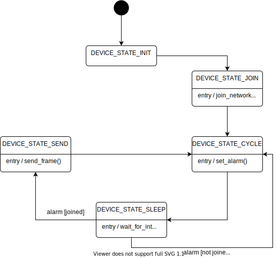

# Simple LoRaWAN Class A/C application 

## 1. Description

This application automatically submits a Join-Request to the LoRa Network server.

Uplinks are sent periodically once the Join-Accept is received.

The application also demonstrates how to interpret a command received by downlink to control the state of an LED.

## 2. Configuration 

### 2.1. LoRaWAN configuration

The `main_lorawan.h` header file define several constants which value can be set to define the LoRaWAN configuration of the application.

| Constant              | Comments |
| --------------------- | -------- |
| `LORAWAN_REGION_USED` | Select the regulatory region. |
| `LORAWAN_CLASS_USED`  | LoRaWAN device class. |
| `LORAWAN_DUTYCYCLE_ON` | Enable/disable the Duty Cycle |
| `LORAWAN_CONFIRMED_MSG_ON` | Request a confirmation message or not |
| `LORAWAN_DEFAULT_DATARATE` | Selection of the Data Rate |

Supported values for `LORAWAN_REGION_USED`:

* `LR1110_LORAWAN_REGION_EU868 (default)`
* `LR1110_LORAWAN_REGION_US915`
* `LR1110_LORAWAN_REGION_AU915`
* `LR1110_LORAWAN_REGION_CN470`
* `LR1110_LORAWAN_REGION_AS923_GRP1`
* `LR1110_LORAWAN_REGION_AS923_GRP2`
* `LR1110_LORAWAN_REGION_AS923_GRP3`
* `LR1110_LORAWAN_REGION_IN865`
* `LR1110_LORAWAN_REGION_KR920`
* `LR1110_LORAWAN_REGION_RU864`

Supported values for `LORAWAN_CLASS_USED`:

* `LR1110_LORAWAN_CLASS_A (default)`
* `LR1110_LORAWAN_CLASS_C`

Supported values for `LORAWAN_DEFAULT_DATARATE`:

* `LR1110_MODEM_ADR_PROFILE_NETWORK_SERVER_CONTROLLED (default)`
* `LR1110_MODEM_ADR_PROFILE_MOBILE_LONG_RANGE`
* `LR1110_MODEM_ADR_PROFILE_MOBILE_LOW_POWER`
* `LR1110_MODEM_ADR_PROFILE_CUSTOM`

When `LORAWAN_DEFAULT_DATARATE` is set to `LR1110_MODEM_ADR_PROFILE_CUSTOM` then a list of Data Rates must be provided to `lr1110_modem_set_adr_profile()`. See the example of `adr_custom_list` in `main_lorawan.h`.

### 2.2. Join configuration

The LR1110 is pre-provisioned with a ChipEUI/DevEUI and a JoinEUI. The application will use these identifiers if the `USE_PRODUCTION_KEYS` is equal to one. 

Alternatively, you can provide your own EUIs in `Inc/apps/lorawan_commissioning/lorawan_commissioning.h` by setting `USE_PRODUCTION_KEYS` to any other value and by changing the values of `LORAWAN_DEVICE_EUI` and `LORAWAN_JOIN_EUI` and `LORAWAN_APP_KEY`.

### 2.3. Uplink configuration

The `APP_TX_DUTYCYCLE` constant in `main_lorawan.h` defines the Uplink transmission period, in milliseconds. The default transmission period is equal to 20 seconds.

The payload of the Uplink packets is initialized in `send_frame()` just before being sent.

### 2.4. Low Power

The application will set the system to low power mode between LR1110 events.

The `APP_PARTIAL_SLEEP` configuration option controls the extent of the peripherals that stay active in low power mode. When the option is false all peripherals are powered down, including the GPIOs that control the LEDs. When the option is true, on the other hand, the GPIOs that control the LEDs stay active. The drawback is that in this mode the system will use much more power.

## 3. Usage

### 3.1. Serial console

The application requires no user intervention after the static configuration option have been set.

Information messages are displayed on the serial console, starting with the DevEUI, AppEUI/JoinEUI and PIN that you might need to register your device with the LoRa Cloud Device Join service.

### 3.2. Downlink messages

The application will handle TLV-encoded messages received on port `APPLICATION_MSG_PORT`.

The following command sequence will turn on the RX LED:

* T=`SET_RX_LED_CMD (0x4F)` 
* L=0x01
* V=0x01

The following command sequence will turn off the RX LED:

* T=`SET_RX_LED_CMD (0x4F)`
* L=0x01
* V=0x00

Note that the `APP_PARTIAL_SLEEP` option must be set to true to see the effect of these commands.

## 4. Miscellaneous

### 4.1. Application main loop

The application puts the STM32 MCU to sleep after setting an alarm. When the alarm triggers, it wakes the MCU that processes the event before going back to sleep. The alarm period is the same as the uplink period, so each time the system wakes up triggers an uplink.

### 4.2. LEDs

There is a bi-color LED on the LoRa Edge Tracker Reference Design board:

* the LED turns yellow when the Tracker is receiving a radio message (downlink)
* the LED turns red when the Tracker is emitting a radio message (uplink)

The application uses the LED of the LoRa Edge Tracker Reference Design to display the following events:

* application startup: the LED blinks
* uplink frame sent: the TX LED flashes once
* downlink frame received: the RX LED flashes once
* `SET_RX_LED_CMD` command received as a TLV-encoded downlink frame: the RX LED is turned on or off depending on the argument
