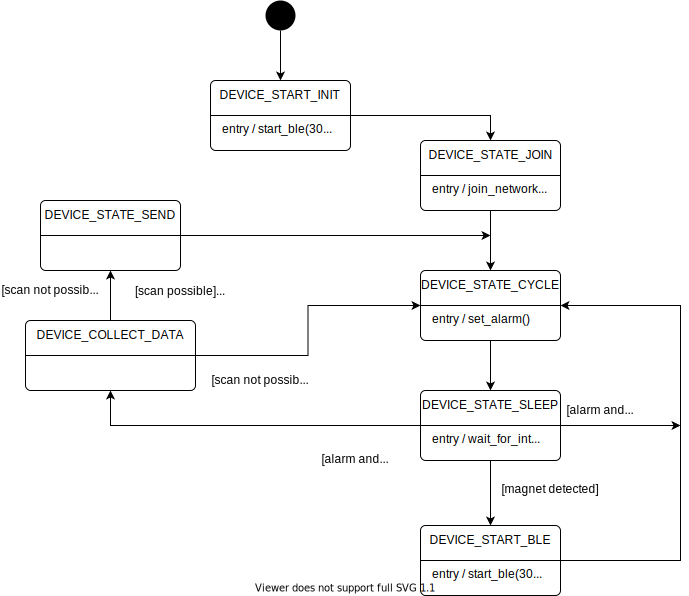

# Tracker application 

## 1. Description

This application automatically submits a Join-Request to the LoRa Network Server.

When connected, it performs Wi-Fi Scans, GNSS scans and various sensor measurements. The scanned data is then streamed using the Device And Application services from LoRa Cloud.

## 2. Configuration

### 2.1. LoRaWAN Configuration

The `main_tracker.h` header file defines several constants which value can be set to define the LoRaWAN configuration of the application.

Note: the constants described below define the default value for a configuration option. If the Tracker application has already been configured it will ignore this default value and keep on using the previously configured value. You will need to set the `FORCE_NEW_TRACKER_CONTEXT` constant to one if you want the application to use the new default configuration options.

| Constant              | Comments |
| --------------------- | -------- |
| `LORAWAN_REGION_USED` | Select the regulatory region. |
| `LORAWAN_CLASS_USED`  | LoRaWAN device class. |
| `LORAWAN_DUTYCYCLE_ON` | Enable/disable the Duty Cycle |

Supported values for `LORAWAN_REGION_USED`:

* `LR1110_LORAWAN_REGION_EU868 (default)`
* `LR1110_LORAWAN_REGION_US915`
* `LR1110_LORAWAN_REGION_AU915`
* `LR1110_LORAWAN_REGION_CN470`
* `LR1110_LORAWAN_REGION_AS923_GRP1`
* `LR1110_LORAWAN_REGION_AS923_GRP2`
* `LR1110_LORAWAN_REGION_AS923_GRP3`
* `LR1110_LORAWAN_REGION_IN865`
* `LR1110_LORAWAN_REGION_KR920`
* `LR1110_LORAWAN_REGION_RU864`

Supported values for `LORAWAN_CLASS_USED`:

* `LR1110_LORAWAN_CLASS_A (default)`
* `LR1110_LORAWAN_CLASS_C`

### 2.2. Join configuration

The LR1110 is pre-provisioned with a ChipEUI/DevEUI and a JoinEUI. The application will use these identifiers if the `USE_PRODUCTION_KEYS` is equal to one. 

Alternatively, you can provide your own EUIs in `Inc/apps/lorawan_commissioning/lorawan_commissioning.h` by setting `USE_PRODUCTION_KEYS` to any other value and by changing the values of `LORAWAN_DEVICE_EUI` and `LORAWAN_JOIN_EUI` and `LORAWAN_APP_KEY`.

### 2.3. ADR configuration

In order to achieve the best "Location Error Rate" it's strongly advised to use the following ADR profile :
- ADR Custom for regions using duty cycle : LR1110_LORAWAN_REGION_EU868 and LR1110_LORAWAN_REGION_RU864
- ADR mobile long range for the regions don't using duty cycle : the rest of the regions supported by the Modem-E

### 2.3. LoRa Edge Config application

The application can be configured using 'LoRa Edge Config' Android and iOS App running on a compatible smartphone. Communication between the smartphone and the Tracker application uses the Bluetooth Low Energy (BLE) wireless technology. The Tracker application starts advertising at startup and then whenever it detects the presence of a magnet. It stops advertising after 30 seconds when not paired. The timeout value is configured by the `TRACKER_ADV_TIMEOUT_MS` constant.

## 3. Miscellaneous

### 3.1. Application main loop

The application puts the STM32 MCU to sleep after setting an alarm. The MCU is taken out of sleep either by the alarm.

### 3.2. Application Watchdog

The application initializes and start the watchdog timer of the STM32 host MCU just before entering the main processing loop. This ensures that the MCU would reset and the application would restart if the the watchdog timer were not reset before is elapses. This forms a protection against the MCU not waking up from its sleep state.

### 3.3. Airplane Mode

The initial default configuration puts the Tracker device in airplane mode. In this mode, the device does not automatically join the LoRaWAN network. The Hall sensor effect is also only enabled for a short period of time each time the tracker detect a motion. The device can be taken out of the airplane mode using the LoRa Edge Config application.

When the batteries are depleted, the device is automatically put back in airplane mode.

### 3.4. Hall effect sensor

The Hall effect sensor is used as a switch to start BLE advertising. It is activated when the user puts a magnet nearby. In airplane mode, the Hall effect sensor is only active at startup and during a 60-second interval when the tracker detects a motion. The activation duration is configured by the `TRACKER_HALL_TIMEOUT_MS` constant.

### 3.5. LEDs

There is a bi-color LED on the LoRa Edge Tracker Reference Design board:

* the LED turns yellow when the Tracker is receiving a radio message (downlink)
* the LED turns red when the Tracker is emitting a radio message (uplink)

The yellow component is then called the RX LED and the red component is the TX LED. 

The application uses the LED of the Lora Edge Tracker Reference Design to display the following events:

* application startup: the LEDs blink twice with a 100 ms period.
* battery depleted: the LEDs blink five time with a 500 ms period.
* clock synchronized: the RX LED blinks four times with a 100 ms period.
* clock unsynchronized: the TX LED blinks four times with a 100 ms period.
* BLE radio activity: the TX LED blinks continuously.
* Hall effect sensor interrupt: the RX LED is turned on. The LED is turned off when the interrupt is acknowledged.
* uplink frame sent: the TX LED flashes once. The duration of the event can be configured with the `LED_PERIOD_MS` constant.
* downlink frame received: the RX LED flashes once. The duration of the event can be configured with the `LED_PERIOD_MS` constant.
