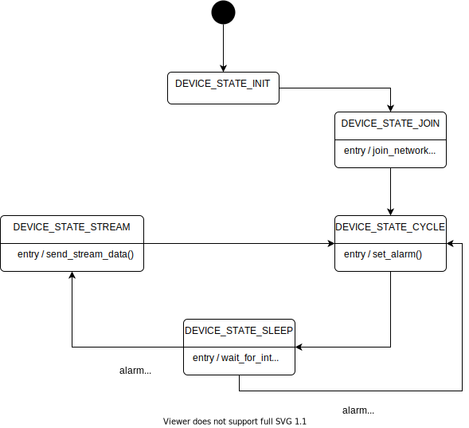

# Simple LoRaWAN Data streaming application 

## 1. Description

This application automatically submits a Join-Request to the LoRa Network Server.

Data is periodically streamed once the Join-Accept is received.

## 2. Configuration 

### 2.1. LoRaWAN configuration

The `main_stream.h` header file define several constants which value can be set to define the LoRaWAN configuration of the application.

| Constant              | Comments |
| --------------------- | -------- |
| `LORAWAN_REGION_USED` | Select the regulatory region. |
| `LORAWAN_CLASS_USED`  | LoRaWAN device class. |
| `LORAWAN_DUTYCYCLE_ON` | Enable/disable the Duty Cycle |
| `LORAWAN_DEFAULT_DATARATE` | Selection of the Data Rate |

Supported values for `LORAWAN_REGION_USED`:

* `LR1110_LORAWAN_REGION_EU868 (default)`
* `LR1110_LORAWAN_REGION_US915`
* `LR1110_LORAWAN_REGION_AU915`
* `LR1110_LORAWAN_REGION_CN470`
* `LR1110_LORAWAN_REGION_AS923_GRP1`
* `LR1110_LORAWAN_REGION_AS923_GRP2`
* `LR1110_LORAWAN_REGION_AS923_GRP3`
* `LR1110_LORAWAN_REGION_IN865`
* `LR1110_LORAWAN_REGION_KR920`
* `LR1110_LORAWAN_REGION_RU864`

Supported values for `LORAWAN_CLASS_USED`:

* `LR1110_LORAWAN_CLASS_A (default)`
* `LR1110_LORAWAN_CLASS_C`

Supported values for `LORAWAN_DEFAULT_DATARATE`:

* `LR1110_MODEM_ADR_PROFILE_NETWORK_SERVER_CONTROLLED (default)`
* `LR1110_MODEM_ADR_PROFILE_MOBILE_LONG_RANGE`
* `LR1110_MODEM_ADR_PROFILE_MOBILE_LOW_POWER`
* `LR1110_MODEM_ADR_PROFILE_CUSTOM`

When `LORAWAN_DEFAULT_DATARATE` is set to `LR1110_MODEM_ADR_PROFILE_CUSTOM` then a list of Data Rates must be provided to `lr1110_modem_set_adr_profile()`. See the example of `adr_custom_list` in `main_stream.h`.

### 2.2. Join configuration

The LR1110 is pre-provisioned with a ChipEUI/DevEUI and a JoinEUI. The application will use these identifiers if the `USE_PRODUCTION_KEYS` is equal to one. 

Alternatively, you can provide your own EUIs in `Inc/apps/lorawan_commissioning/lorawan_commissioning.h` by setting `USE_PRODUCTION_KEYS` to any other value and by changing the values of `LORAWAN_DEVICE_EUI` and `LORAWAN_JOIN_EUI` and `LORAWAN_APP_KEY`.

### 2.3. Stream configuration

The `APP_STREAM_PERIOD` constant in `main_stream.h` defines the stream transmission period, in milliseconds.

The `TRACKER_STREAM_REDUNDANCY_RATE` configures the stream redundancy rate.

## 3. Usage

### 3.1. Serial console

The application requires no user intervention after the static configuration option have been set.

Information messages are displayed on the serial console, starting with the DevEUI, AppEUI/JoinEUI and PIN that you might need to register your device with the LoRa Cloud Device Join service.

## 4. Miscellaneous

### 4.1. Application main loop

The application puts the STM32 MCU to sleep after setting an alarm. When the alarm triggers, it wakes the MCU that processes the event before going back to sleep. The alarm period is the same as the send period, so each time the system wakes up is send a frame.

### 4.2. LEDs

There are three LEDs on the LR1110 shield:

* RX (green)
* TX (red)

The application uses the LEDs of the LoRa Edge Tracker Reference Design to display the following events:

* application startup: all two LEDs blink
* uplink frame sent: the TX LED flashes once
* downlink frame received: the RX LED flashes once
